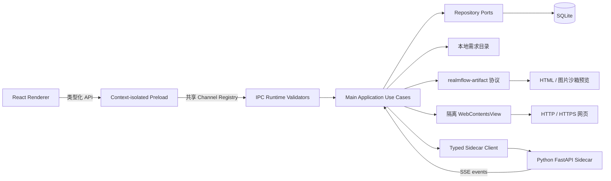

# RealmFlow

RealmFlow 是一个本地优先的软件研发全流程桌面工作区，用于组织需求、研发阶段、模板、定时任务及各阶段交付产物。

当前版本为 `0.1.0`，已完成桌面客户端基础框架、空间与需求管理、SQLite 业务主存储、AI Run 流式执行，以及需求目录中的 Markdown、HTML 和代码产物浏览与编辑能力。

## 当前能力

- 可折叠、可调整宽度的左侧导航。
- 新对话 Composer、提示词模板创建、标签筛选和变量替换。
- 定时任务列表及对话式新建任务弹窗。
- 空间和需求的创建、重命名、折叠与强确认删除。
- 需求详情及六阶段研发流程：
  - 需求分析
  - 技术方案
  - 开发实现
  - 测试验证
  - 发布上线
  - 迭代复盘
- 每个需求可绑定一个独立的本地工作目录。
- 通过 SQLite 产物元数据将本地文件关联到对应研发阶段。
- 需求阶段可通过 Python Sidecar 流式生成阶段产物：
  - Electron Main 负责业务编排、运行状态和最终提交。
  - SSE 支持分帧、心跳、sequence 去重和 `Last-Event-ID` 重连。
  - 支持实时进度、内容预览、取消、失败和完成状态。
  - 只有产物校验与数据库事务成功后才替换正式文件。
- SQLite 持久化空间、需求、会话、资源、产物元数据、AI Run 和运行事件。
- 应用重启后将未结束 Run 标记为 `interrupted`，保留历史并允许重试。
- 应用级右侧工作区默认收起，由页面内容按需触发：
  - 点击页面中的本地文件或文件夹入口后打开对应资源。
  - 点击页面中的 `HTTP/HTTPS` 链接后在隔离网页视图中打开。
  - 需求阶段节点可直接打开对应阶段产物。
  - 页面切换时保持工作区打开，并保留宽度、标签与未保存内容。
  - 存在已打开内容时提供单一全局恢复入口。
- 本地文件工作区支持：
  - 懒加载目录树和多文件标签页。
  - Monaco Editor 代码编辑与语法高亮。
  - Markdown 编辑和安全预览。
  - HTML 编辑和沙箱预览。
  - 图片只读预览。
  - 保存按钮及 `Command/Ctrl + S`。
  - 文件外部修改冲突检测。
  - Finder 中定位文件。

## 技术架构



| 层级 | 技术与职责 |
| --- | --- |
| 领域层 | 纯 TypeScript 业务模型与校验，不依赖 React、页面或存储实现 |
| 应用层 | Main Use Case、Repository Ports，以及 Renderer Controller / Reducer |
| 展示层 | React 页面、功能组件、路由与纯视图布局 |
| 基础设施层 | SQLite Repository、Sidecar Gateway、文件服务与 Renderer IPC Repository |
| 桌面容器 | Electron 30，负责窗口、生命周期、业务编排、IPC 和本地文件访问 |
| 主存储 | `better-sqlite3`，启用外键、WAL、busy timeout、Migration 和 revision CAS |
| 编辑器 | Monaco Editor，本地加载编辑器和语言 Worker |
| 文档预览 | React Markdown、GFM、HTML 沙箱 iframe |
| Preload | 类型化、白名单化的 IPC 桥接，共享 channel registry |
| IPC 边界 | 对所有 privileged command 做运行时 payload 校验 |
| Sidecar | Python 3.11、FastAPI、Uvicorn、确定性 Fake AI Provider 和 SSE |
| 测试 | Vitest、Testing Library、Pytest |
| 构建 | electron-vite、electron-builder、PyInstaller |

渲染进程保持：

```text
sandbox: true
contextIsolation: true
nodeIntegration: false
webSecurity: true
```

React 不直接访问 Node.js、SQLite、Sidecar 或文件系统。目录选择、文件读取、保存、产物元数据和 Finder 定位均由主进程校验后执行。

详细依赖规则、状态归属和运行时边界见
[`docs/architecture.md`](docs/architecture.md)。

## 数据与产物存储

Electron Main 是业务数据的唯一所有者。数据库位于：

```text
app.getPath('userData')/realmflow.db
```

| 数据 | 所有权与存储 |
| --- | --- |
| 空间、需求和阶段 | SQLite |
| 对话会话和消息 | SQLite |
| 空间资源元数据 | SQLite |
| 产物路径、类型、校验和与版本 | SQLite |
| AI Run、终态、错误和控制事件 | SQLite |
| 需求正文和正式阶段产物 | 需求绑定目录 |
| 用户导入文件 | 文件系统 |
| 侧栏宽度等纯 UI 偏好 | Renderer `localStorage` |

旧版 `renderer-state.json`、workspace bindings 和必要的
`.realmflow/requirement.json` 只作为一次性迁移源。迁移会先校验数据，在一个
SQLite 事务内导入并验证关联关系，成功后写入 marker 和时间戳备份；失败时回滚数据库且不修改源文件。

正式产物采用临时文件与 SQLite 事务协调提交：Main 写入临时文件，在同一事务中更新需求阶段、Artifact 元数据、Run 终态和完成事件，完成原子 rename 后才提交事务。

阶段标识为：

| 标识 | 阶段 |
| --- | --- |
| `analysis` | 需求分析 |
| `design` | 技术方案 |
| `implementation` | 开发实现 |
| `testing` | 测试验证 |
| `release` | 发布上线 |
| `retrospective` | 迭代复盘 |

产物路径必须相对于绑定目录。主进程会拒绝绝对路径、目录穿越和指向目录外部的符号链接。

## 环境要求

- macOS Apple Silicon，用于当前安装包构建。
- Node.js 20 或更高版本。
- npm。
- Python 3.11。
- Xcode Command Line Tools，用于 `codesign`、`pkgbuild` 和 `ditto`。

## 本地开发

安装 Node.js 依赖：

```bash
npm install
```

创建 Python 虚拟环境并安装 Sidecar 依赖：

```bash
python3.11 -m venv .venv
source .venv/bin/activate
pip install -r python-service/requirements.txt
pip install pytest httpx pyinstaller
```

启动 Electron 开发环境：

```bash
npm run dev
```

`npm run dev` 会先通过 `electron-rebuild` 将 `better-sqlite3` 和
`node-pty` 重建为 Electron ABI。`npm test` 会自动恢复 Node.js 测试 ABI，
因此开发启动和测试可以交替执行。

开发模式优先使用 `.venv/bin/python` 启动 Sidecar，也可以显式指定：

```bash
REALMFLOW_PYTHON=/path/to/python npm run dev
```

Sidecar 启动时会自动选择可用的本地端口，并通过 typed client 校验健康响应。若 Sidecar 不可用，桌面窗口仍可打开，侧栏底部会显示异常状态。

## 常用命令

```bash
# TypeScript 类型检查
npm run typecheck

# 前端及 Electron 测试
npm test

# 监听模式运行测试
npm run test:watch

# Python Sidecar 测试
.venv/bin/python -m pytest python-service/tests

# 生产构建，不生成安装包
npm run build

# 强制重建 Electron native 模块
npm run rebuild:native

# 在 Electron 运行时验证 SQLite
npm run verify:sqlite
```

## macOS 打包

生成 Apple Silicon 安装包：

```bash
npm run dist:mac
```

产物位于 `release/`：

```text
release/RealmFlow-0.1.0-arm64.pkg
release/RealmFlow-0.1.0-arm64.zip
```

PKG 默认安装到 `/Applications/RealmFlow.app`。当前构建使用本地临时签名，尚未接入 Apple Developer ID 和公证流程，首次运行可能出现未知开发者提示。

## 项目结构

```text
.
├── domain/                         # 跨 Main/Renderer 的核心领域模型
├── electron/
│   └── src/
│       ├── main.ts                 # Main Composition Root
│       ├── preload.ts              # 类型化、白名单化 IPC 桥接
│       ├── application/            # Main Use Case 与 Repository Ports
│       ├── infrastructure/sqlite/  # Migration、Repository 和 Legacy 导入
│       ├── ai-run/                 # AI Run、SSE Adapter 与 Artifact 事务提交
│       ├── ipc/                    # Channel 注册与运行时参数校验
│       ├── persistence/            # Renderer 聚合数据的 SQLite 访问服务
│       ├── sidecar/                # Sidecar 生命周期和 typed client
│       ├── terminal/               # node-pty 终端管理
│       ├── overlay/                # 原生浮层管理
│       ├── workbench/              # 隔离网页视图和导航控制
│       └── workspace/              # 安全文件服务、元数据 Store 和预览协议
├── python-service/
│   ├── app/api/                    # Health、Info 和 Run API
│   ├── app/core/                   # Sidecar 配置
│   ├── app/services/               # Run 执行、回放、取消和 Fake Provider
│   ├── app/agents/                 # 多 Agent 预留目录
│   ├── app/rag/                    # RAG 预留目录
│   ├── tests/                      # Sidecar 测试
│   └── main.py                     # Sidecar 入口
├── shared/
│   ├── ipc-contract.ts             # Preload / Main channel 单一注册表
│   ├── ai-run.ts                   # AI Run 跨进程契约
│   ├── persistence.ts              # 持久化与 revision conflict 契约
│   ├── types.ts                    # Renderer / Electron 公共类型
│   ├── workbench.ts                # 网页工作区数据契约
│   └── workspace.ts                # 文件工作区数据契约
├── src/
│   ├── app/                        # 路由装配与 Controller Hooks
│   ├── application/                # Renderer Ports、Reducer 与纯状态机
│   ├── components/                 # 通用 UI 组件
│   ├── domain/                     # 空间、会话和资源领域模型
│   ├── features/                   # Artifact、导航、会话和 Workbench 模块
│   ├── infrastructure/storage/     # 类型化 IPC Repository 与 Domain Codec
│   ├── pages/                      # 新对话、定时任务、需求详情
│   ├── App.tsx                     # 全局 Provider、侧栏和应用壳
│   └── styles.css                  # 全局界面样式
├── docs/                            # 架构、规格和实施计划
├── resources/sidecar/               # 打包使用的 Sidecar 二进制
├── scripts/
│   ├── build-mac-installer.sh      # macOS PKG/ZIP 打包
│   ├── build-python.sh             # PyInstaller Sidecar 构建
│   ├── verify-electron-sqlite.cjs  # Electron SQLite ABI 验证
│   └── dev.mjs                     # Electron 开发启动入口
└── build/electron-builder.yml      # Electron 打包配置
```

## 安全边界

- 需求产物只允许访问需求已绑定的本地目录。
- 用户临时选择的文件或文件夹使用会话级授权，退出应用后失效。
- 读取前会解析真实路径，阻止目录穿越和越界符号链接。
- 文本编辑文件默认限制为 2 MB。
- 保存时校验文件版本，避免覆盖外部程序产生的新修改。
- 写入使用临时文件和原子替换。
- HTML 预览禁用脚本、网络连接、表单、弹窗和 Node.js 能力。
- 网页视图仅允许 `HTTP/HTTPS`，使用隔离会话并拒绝权限、弹窗和下载。
- Renderer 不暴露任意文件系统、Shell 或通用 IPC 调用。
- Renderer 与 Python Sidecar 均禁止直接访问 SQLite。
- IPC 不接收任意 SQL，也不暴露数据库路径、Statement 或连接对象。
- SQLite Repository 只使用预编译语句，并通过 Application Port 暴露能力。
- 可并发修改的聚合使用 revision CAS；冲突返回最新快照，不静默覆盖。
- IPC handler 在调用主进程服务前校验字符串、枚举、尺寸和嵌套对象。
- Preload 与 Main 的 channel 集合由自动化契约测试保持一致。

## 当前限制

- 当前 Sidecar 使用确定性 Fake AI Provider，尚未接入真实 LLM。
- 尚未实现 RAG、Embedding、Chroma 和向量索引。
- 尚未实现多 Agent、流程引擎、技能引擎和定时调度执行。
- Sidecar 内存中的活动流不会跨应用重启恢复；Main 会将未结束 Run 标记为 `interrupted`。
- 产物工作区暂不提供文件创建、重命名和删除操作。
- HTML 预览以安全性优先，不运行 JavaScript，也不访问外部网络。
- 当前安装包流程仅验证 macOS Apple Silicon。

## License

[MIT](LICENSE)
