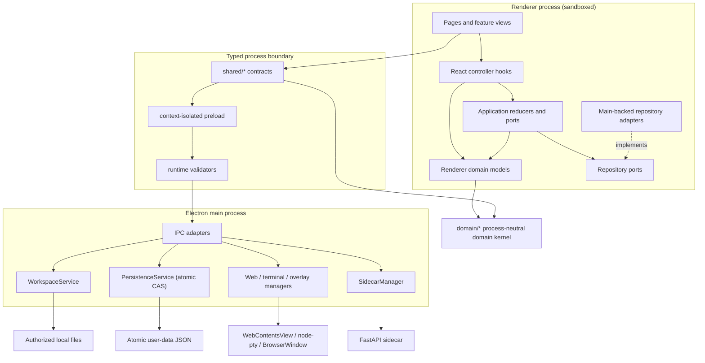

# RealmFlow Architecture

## Runtime boundaries



The renderer is a low-privilege client. It cannot import Electron or Node
capabilities. All privileged operations cross `window.realmflow`, whose shape
is defined under `shared/` and implemented by the context-isolated preload.

## Renderer layers

Dependencies point downward:

```text
app / pages / features
      |          \
      v           v
 app/hooks ---> src/domain ---> root domain kernel
      |
      v
 application ---> src/domain

infrastructure ---> application ports
features ---------> shared IPC contracts
shared contracts --> root domain kernel
```

- Root `domain/` owns process-neutral domain primitives shared by Renderer and
  IPC contracts. `src/domain/` owns Renderer domain models and may re-export
  those primitives.
- `application/` owns framework-independent state transitions and ports. It
  must not import React or contain `.tsx` modules.
- `app/hooks/` adapts application reducers and repository ports to React
  lifecycle and state.
- `application/ports/` defines persistence capabilities without importing
  concrete browser storage.
- `infrastructure/storage/` owns serialization, version migration and storage
  failure handling.
- `features/` owns feature presentation. Providers coordinate external
  lifecycles; layout components render state and callbacks.
- `app/AppRoutes.tsx` is the only renderer module that assembles page routes.
- `App.tsx` is the composition root that injects concrete repositories into
  application controllers and pages.
- `pages/` must not be used as a shared type or data-model layer.

These rules are checked by `src/architecture.test.ts`.

## State ownership

| State | Owner | Persistence |
| --- | --- | --- |
| Spaces and requirements | Workspace React adapter/reducer | Main-process versioned repository |
| Chat sessions | Workspace React adapter/reducer | Main-process versioned repository |
| Space knowledge resources | Space resource repository | Main-process versioned repository |
| Workbench tabs and active tab | Workbench reducer | Renderer lifetime |
| Unsaved editor drafts | Artifact workbench tab | Renderer lifetime |
| Requirement directory bindings | `WorkspaceService` | Electron user data |
| Stage artifact manifest | `WorkspaceService` | `.realmflow/requirement.json` |
| Terminal and web native objects | Electron managers | Process lifetime |

The `WorkbenchProvider` is mounted outside page routes. Route changes therefore
do not remount tabs, close the right panel or discard unsaved editor state.
The provider is a composition layer: command workflows, panel geometry,
terminal sessions and native overlay/web-view synchronization live in
`features/workbench/hooks/`. An architecture test keeps the provider below 260
lines and requires those responsibility-specific hooks.

## Persistence rules

Persisted Renderer models use domain codecs in
`infrastructure/storage/` and an atomic Main-process service:

1. Parse and validate stored values through a domain codec.
2. Fall back to a valid default when data is missing or corrupt.
3. Import legacy `localStorage` data with a revision-0 compare-and-swap.
4. Initialize repositories before mounting React to prevent fallback data from
   overwriting a persisted snapshot.
5. Keep in-memory behavior available when storage or IPC is unavailable.
6. Require callers to provide the revision they loaded before saving.
7. Serialize compare-and-swap operations in `PersistenceService`.
8. Write the user-data JSON through a temporary file and atomic rename.

Dataset keys, schema versions and legacy keys are centralized in
`persistence-registry.ts`. `main-process-repository.ts` adds:

- A decoded in-memory snapshot for synchronous React initialization.
- Cross-window refresh through Main-process `persistence:changed` broadcasts.
- Serialized asynchronous saves per React controller so rapid local updates
  use the latest acknowledged revision.
- Conflict handling that returns the latest snapshot to the application
  controller without overwriting it.
- Structured `unavailable` results keep in-memory state usable while exposing
  a non-blocking persistence status in the application or space resource view.

`createVersionedRepository` and `persistence-coordinator.ts` remain only as the
legacy/browser compatibility path and migration source. They are not the
Electron production write authority.

Filesystem data is never accessed through browser repositories. It remains
behind `WorkspaceService`, canonical path checks and typed IPC.

## IPC contract

`shared/ipc-contract.ts` is the single registry for invoke, send and event
channel names. The preload API and main-process registration both consume this
registry. `preload-main-contract.test.ts` verifies that every preload invoke is
registered by the main process.

TypeScript types alone do not protect a process boundary. Every persistence,
workspace, web-workbench, terminal and native-overlay handler validates
unknown payloads before calling a privileged service. Invalid datasets,
revisions, non-finite geometry, unsupported enum values and malformed
nested objects are rejected without side effects.

## Sidecar boundary

The Python process is an optional local service managed by Electron. Its
current public contract contains `/health` and `/api/v1/info`; it does not yet
own application data or AI/RAG workflows. Electron accesses these endpoints
through `SidecarClient`, which applies request timeouts, HTTP status checks and
runtime response validation. `SidecarManager` owns process lifecycle and retry
policy, not HTTP parsing.

New sidecar capabilities should be added only with:

1. A concrete API contract and Python route test.
2. A typed client contract exposed through Electron, not direct renderer HTTP.
3. Clear lifecycle and failure behavior when the sidecar is unavailable.

Empty speculative `agents`, `rag` or `services` packages should not be added
before a real use case requires them.

## Verification

```bash
npm test
npm run typecheck
npm run build
.venv/bin/python -m pytest python-service/tests
```
