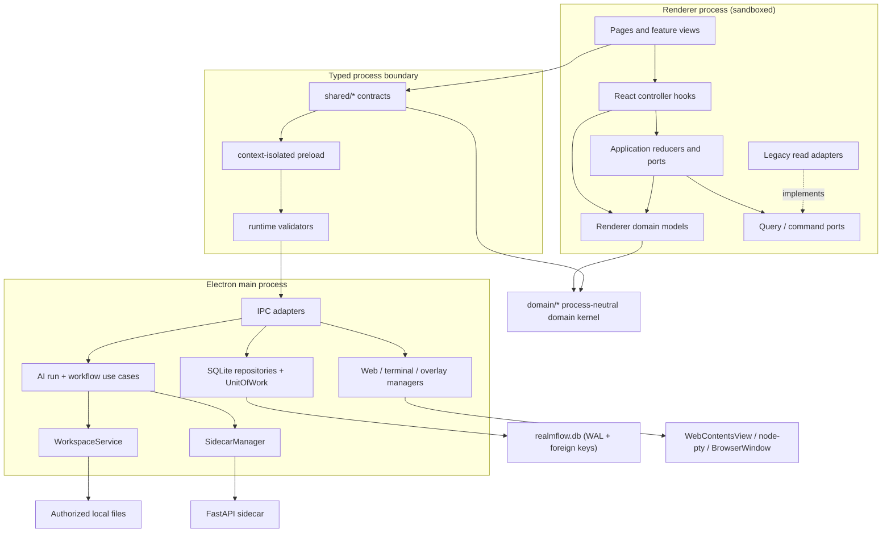

# RealmFlow Architecture

## Runtime boundaries



The renderer is a low-privilege client. It cannot import Electron or Node
capabilities. All privileged operations cross `window.realmflow`, whose shape
is defined under `shared/` and implemented by the context-isolated preload.

## Renderer layers

Dependencies point downward:

```text
app / pages / features
      |          \
      v           v
 app/hooks ---> src/domain ---> root domain kernel
      |
      v
 application ---> src/domain

infrastructure ---> application ports
features ---------> shared IPC contracts
shared contracts --> root domain kernel
```

- Root `domain/` owns process-neutral domain primitives shared by Renderer and
  IPC contracts. `src/domain/` owns Renderer domain models and may re-export
  those primitives.
- `application/` owns framework-independent state transitions and ports. It
  must not import React or contain `.tsx` modules.
- `app/hooks/` adapts application reducers and repository ports to React
  lifecycle and state.
- `application/ports/` defines persistence capabilities without importing
  concrete browser storage.
- `infrastructure/storage/` owns serialization, version migration and storage
  failure handling.
- `features/` owns feature presentation. Providers coordinate external
  lifecycles; layout components render state and callbacks.
- `app/AppRoutes.tsx` is the only renderer module that assembles page routes.
- `App.tsx` is the composition root that injects concrete repositories into
  application controllers and pages.
- `pages/` must not be used as a shared type or data-model layer.

These rules are checked by `src/architecture.test.ts`.

## State ownership

| State | Owner | Persistence |
| --- | --- | --- |
| Work roots, spaces and requirements | Electron Main repositories/use cases | SQLite |
| Requirement DAGs, executions, node runs, todos and questions | Electron Main workflow use cases | SQLite |
| Chat sessions and messages | Electron Main repositories/use cases | SQLite |
| Space resource metadata | Electron Main repositories/use cases | SQLite |
| Artifact metadata | Electron Main artifact transaction | SQLite |
| AI runs and durable run events | Electron Main AI run use cases | SQLite |
| Model providers, profiles, encrypted credentials and metrics | Electron Main model service | SQLite + mode-`0600` key file |
| Knowledge documents and chunks | Electron Main knowledge sync | SQLite |
| Requirement body and formal artifacts | `WorkspaceService` / artifact repository | Authorized filesystem |
| Imported user files | `WorkspaceService` | Authorized filesystem |
| Workbench tabs and active tab | Workbench reducer | Renderer lifetime |
| Unsaved editor drafts | Artifact workbench tab | Renderer lifetime |
| Sidebar width and other pure UI preferences | Renderer | `localStorage` |
| Terminal and web native objects | Electron managers | Process lifetime |

The `WorkbenchProvider` is mounted outside page routes. Route changes therefore
do not remount tabs, close the right panel or discard unsaved editor state.
The provider is a composition layer: command workflows, panel geometry,
terminal sessions and native overlay/web-view synchronization live in
`features/workbench/hooks/`. An architecture test keeps the provider below 260
lines and requires those responsibility-specific hooks.

## SQLite persistence

Electron Main opens `app.getPath('userData')/realmflow.db` through
`better-sqlite3`. Startup enables `foreign_keys`, WAL and `busy_timeout`, then
applies ordered native SQL migrations transactionally. All persisted timestamps
are UTC epoch milliseconds; external ISO timestamps are converted at the
adapter boundary.

The additive schema includes work-root/settings tables, workspace and
requirement metadata, versioned workflow templates and requirement DAGs,
workflow/node executions, todos/questions, conversations, resources,
artifacts, model providers/profiles/credentials/metrics, knowledge records,
AI runs/events, migration markers and legacy dataset revisions. Foreign keys,
ordering columns and uniqueness constraints enforce aggregate relationships.
`ai_run_events` is unique on `(run_id, sequence)`.

Application repository ports live under `electron/src/application/ports/`.
Prepared-statement adapters and the transaction boundary live under
`electron/src/infrastructure/sqlite/`. The Renderer issues narrow business
commands and refreshes query snapshots after acknowledgement; it never sends a
complete business aggregate for persistence. Renderer and Python never import
`better-sqlite3`, database paths, statements or connection objects.

Mutable aggregates use revision compare-and-swap. A stale command cannot
overwrite newer data. `persistence:load` remains exposed only for legacy
migration/read compatibility; `persistence:save` is not registered or exposed
to the Renderer.

`LegacyDataMigrator` is a one-time, idempotent import guarded by
`legacy_imports`. It validates `renderer-state.json`, workspace bindings and
required `.realmflow` manifests, creates a timestamped backup, imports and
verifies counts/relations/revisions in one transaction, then writes the marker.
Validation or SQL failures produce structured diagnostics, roll back SQLite,
remove the incomplete backup and leave every source file unchanged. There is
no long-term JSON/SQLite dual write.

Filesystem content remains behind canonical path checks and typed IPC. For a
generated artifact, Main writes a temporary file first, opens one SQLite
transaction for artifact metadata, requirement stage, run terminal state and
completion event, then renames the file before committing. Rename or SQL
failure rolls back the transaction, restores the previous file when present
and removes temporary files. This prevents a committed metadata row from
silently pointing at a missing formal artifact.

## IPC contract

`shared/ipc-contract.ts` is the single registry for invoke, send and event
channel names. The preload API and main-process registration both consume this
registry. `preload-main-contract.test.ts` verifies that every preload invoke is
registered by the main process.

TypeScript types alone do not protect a process boundary. Every business,
legacy-read, AI-run, workspace, web-workbench, terminal and native-overlay
handler validates unknown payloads before calling a privileged service.
Invalid identifiers, datasets, revisions, non-finite geometry, unsupported
enum values and malformed nested objects are rejected without side effects.

Requirement workflows are copied from a versioned template and then edited as
independent DAG instances. Insert, remove, reorder and edge commands validate
topology and protect completed nodes. Node completion is atomic with downstream
readiness and checks formal artifacts, required todos/questions, approvals and
custom gates.

## Sidecar boundary

The Python process is an optional local execution service managed by Electron.
It exposes `/health`, `/api/v1/info`, `POST /api/v1/runs`,
`GET /api/v1/runs/{run_id}/events` and
`POST /api/v1/runs/{run_id}/cancel`. It executes a deterministic fake provider
for the first phase and never mutates requirement state, persistence data or
formal workspace artifacts.

Electron Main owns the complete run workflow:

1. `ExecuteWorkflowStageUseCase` binds an AI run to a `node_run`, then delegates
   generation to `GenerateStageArtifactUseCase`.
2. `GenerateStageArtifactUseCase` loads stage context through
   `StageContextRepository` and creates the Sidecar run through
   `AiRunGateway`.
3. `SidecarClient` parses SSE frames, validates event envelopes, tracks
   sequence numbers and reconnects at most three times with `Last-Event-ID`.
4. `RunRepository` serializes run updates. Duplicate sequences and late
   non-terminal events after cancellation are ignored.
5. `RunEventPublisher` sends events only to the Renderer that started the run.
   Renderer unmount removes its preload listener but does not cancel Main work.
6. `CancelAiRunUseCase` makes cancellation idempotent. Sidecar cancellation
   errors become typed `run.failed` events.
7. Only `run.completed` with a validated `artifact.ready` payload reaches
   `ArtifactRepository`, which coordinates the filesystem rename with the
   SQLite transaction.
8. The workflow coordinator advances the node, waits for user gates, or mirrors
   failed/cancelled terminal state.

The Sidecar keeps a bounded replay buffer, emits monotonic sequences and allows
exactly one terminal event. Cancellation is idempotent. Renderer code cannot
open Sidecar HTTP connections; all traffic crosses typed preload IPC channels
`ai-run:start`, `ai-run:cancel`, `ai-run:get`, `ai-run:list-events` and
`ai-run:event`.

On startup, unfinished AI and node executions are first marked
`interrupted`. Eligible node runs are then restarted through the same workflow
coordinator with a new Sidecar run and the original node identity. `paused`,
`waiting_user` and `blocked` nodes are never auto-resumed. Manual pause commits
the node state before cancelling its active AI run; manual resume starts and
binds a new run using the selected model profile.

Provider credentials are encrypted with AES-256-GCM in SQLite; the encryption
key is stored under Electron `userData` with mode `0600`. Provider requests
receive credentials in request bodies, never environment variables. Main
records token categories, latency, retries, status and estimated cost without
allowing metrics failures to change run outcomes.

Conversations support general, workspace and requirement-node contexts, plus
local-folder bindings. Requirement-node conversations are queried only from
their node detail and excluded from Recent. When a requirement completes and
sync is enabled, formal artifacts are checksum-synchronized into the local
knowledge store; retryable sync failure does not roll back requirement
completion.

## Verification

```bash
npm test
npm run typecheck
npm run build
.venv/bin/python -m pytest python-service/tests
npm run rebuild:native
npm run verify:sqlite
git diff --check
```
