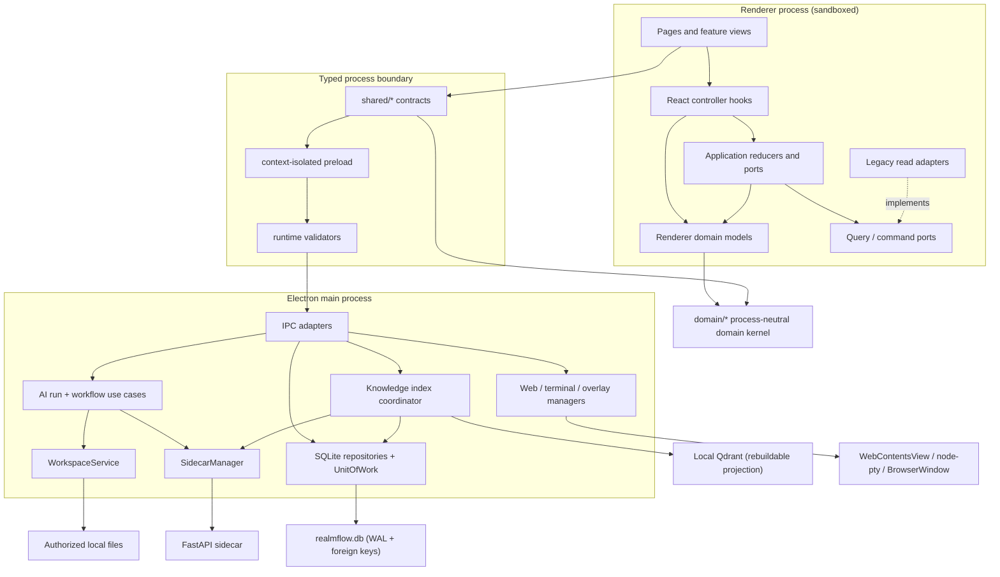

# RealmFlow Architecture

## Runtime boundaries


```mermaid
flowchart TB
  Kernel["domain/* process-neutral domain kernel"]

  subgraph Renderer["Renderer process (sandboxed)"]
    View["Pages and feature views"]
    Hooks["React controller hooks"]
    App["Application reducers and ports"]
    Domain["Renderer domain models"]
    Ports["Query / command ports"]
    Storage["Legacy read adapters"]
    View --> Hooks
    Hooks --> App
    Hooks --> Domain
    App --> Domain
    App --> Ports
    Storage -. implements .-> Ports
  end

  subgraph Bridge["Typed process boundary"]
    Contracts["shared/* contracts"]
    Preload["context-isolated preload"]
    Validators["runtime validators"]
    Contracts --> Preload
    Preload --> Validators
  end

  subgraph Main["Electron main process"]
    IPC["IPC adapters"]
    AiRuns["AI run + workflow use cases"]
    Persistence["SQLite repositories + UnitOfWork"]
    Knowledge["Knowledge index coordinator"]
    Workspace["WorkspaceService"]
    Workbench["Web / terminal / overlay managers"]
    SidecarManager["SidecarManager"]
    IPC --> AiRuns
    AiRuns --> Workspace
    AiRuns --> SidecarManager
    IPC --> Persistence
    IPC --> Knowledge
    Knowledge --> Persistence
    Knowledge --> SidecarManager
    IPC --> Workbench
  end

  Domain --> Kernel
  Contracts --> Kernel
  View --> Contracts
  Validators --> IPC
  Persistence --> SQLite["realmflow.db (WAL + foreign keys)"]
  Knowledge --> Qdrant["Local Qdrant (rebuildable projection)"]
  Workspace --> FS["Authorized local files"]
  Workbench --> Native["WebContentsView / node-pty / BrowserWindow"]
  SidecarManager --> Sidecar["FastAPI sidecar"]
```

The renderer is a low-privilege client. It cannot import Electron or Node
capabilities. All privileged operations cross `window.realmflow`, whose shape
is defined under `shared/` and implemented by the context-isolated preload.

## Renderer layers

Dependencies point downward:

```text
app / pages / features
      |          \
      v           v
 app/hooks ---> src/domain ---> root domain kernel
      |
      v
 application ---> src/domain

infrastructure ---> application ports
features ---------> shared IPC contracts
shared contracts --> root domain kernel
```

- Root `domain/` owns process-neutral domain primitives shared by Renderer and
  IPC contracts. `src/domain/` owns Renderer domain models and may re-export
  those primitives.
- `application/` owns framework-independent state transitions and ports. It
  must not import React or contain `.tsx` modules.
- `app/hooks/` adapts application reducers and repository ports to React
  lifecycle and state.
- `application/ports/` defines persistence capabilities without importing
  concrete browser storage.
- `infrastructure/storage/` owns serialization, version migration and storage
  failure handling.
- `features/` owns feature presentation. Providers coordinate external
  lifecycles; layout components render state and callbacks.
- `app/AppRoutes.tsx` is the only renderer module that assembles page routes.
- `App.tsx` is the composition root that injects concrete repositories into
  application controllers and pages.
- `pages/` must not be used as a shared type or data-model layer.

These rules are checked by `src/architecture.test.ts`.

## State ownership

| State | Owner | Persistence |
| --- | --- | --- |
| Work roots, spaces and requirements | Electron Main repositories/use cases | SQLite |
| Requirement DAGs, executions, node runs, todos and questions | Electron Main workflow use cases | SQLite |
| Chat sessions and messages | Electron Main repositories/use cases | SQLite |
| Space resource metadata | Electron Main repositories/use cases | SQLite |
| Artifact metadata | Electron Main artifact transaction | SQLite |
| AI runs and durable run events | Electron Main AI run use cases | SQLite |
| Model providers, profiles, encrypted credentials and metrics | Electron Main model service | SQLite + mode-`0600` key file |
| Knowledge source versions, jobs, generations and current pointers | Electron Main knowledge services | SQLite |
| Searchable knowledge chunks and Dense/BM25 indexes | Electron Main Qdrant adapters | Local Qdrant, rebuildable |
| Requirement body and formal artifacts | `WorkspaceService` / artifact repository | Authorized filesystem |
| Imported user files | `WorkspaceService` | Authorized filesystem |
| Workbench tabs and active tab | Workbench reducer | Renderer lifetime |
| Unsaved editor drafts | Artifact workbench tab | Renderer lifetime |
| Sidebar width and other pure UI preferences | Renderer | `localStorage` |
| Terminal and web native objects | Electron managers | Process lifetime |

The `WorkbenchProvider` is mounted outside page routes. Route changes therefore
do not remount tabs, close the right panel or discard unsaved editor state.
The provider is a composition layer: command workflows, panel geometry,
terminal sessions and native overlay/web-view synchronization live in
`features/workbench/hooks/`. An architecture test keeps the provider below 260
lines and requires those responsibility-specific hooks.

General and space conversations share one Main-owned turn state machine.
`CreateSpaceConversationUseCase` first validates and fixes the workspace
identity; each send then checks that workspace again and asks
`SpaceConversationContextAssembler` for matching local knowledge before the
atomic user-plus-assistant-placeholder write. Retrieval failure therefore
cannot leave a partial turn or Provider Run. The Sidecar receives the assembled
knowledge as a system context before persisted message history, but never
receives the workspace path or an implicit file, terminal or repository grant.

Requirement-node conversations reuse that turn state machine but remain bound
to one current NodeRun and are queried only through the requirement execution
view. `BeginRequirementNodeTurnUseCase` commits an optional B16 question answer,
its transition history, the linked user message and pending assistant in one
SQLite unit of work. After commit, B16 reevaluates completion gates; C07 supplies
fresh node context for every Provider Run. Terminal node conversations are
read-only and never enter Recent or workspace conversation lists.

Folder conversations also reuse the general turn state machine without creating
a workspace. Electron Main converts a native directory selection into a
process-local opaque binding, canonicalizes it through `SecurePathService`, and
persists only the resolved path with the conversation. Every later turn
revalidates that persisted directory before model routing or message writes.
The folder path scopes the Sidecar Run but is not forwarded to the Provider and
does not grant automatic file, terminal or repository operations.

Recent conversations are a Main-owned SQLite query with an immutable
`general | space` base predicate. Type, workspace, canonical folder and
inclusive update-time filters are validated at IPC before parameterized SQL
execution. Renderer stores only versioned filter preferences, discards stale
responses by request sequence and keeps the filtered sidebar result separate
from the conversation detail cache. Successful creates and appends merge the
committed Main snapshot before refreshing the current query.

## SQLite persistence

Electron Main opens `app.getPath('userData')/realmflow.db` through
`better-sqlite3`. Startup enables `foreign_keys`, WAL and `busy_timeout`, then
applies ordered native SQL migrations transactionally. All persisted timestamps
are UTC epoch milliseconds; external ISO timestamps are converted at the
adapter boundary.

The additive schema includes work-root/settings tables, workspace and
requirement metadata, versioned workflow templates and requirement DAGs,
workflow/node executions, todos/questions, conversations, resources,
artifacts, model providers/profiles/credentials/metrics, knowledge records,
AI runs/events, migration markers and legacy dataset revisions. Foreign keys,
ordering columns and uniqueness constraints enforce aggregate relationships.
`ai_run_events` is unique on `(run_id, sequence)`.

Application repository ports live under `electron/src/application/ports/`.
Prepared-statement adapters and the transaction boundary live under
`electron/src/infrastructure/sqlite/`. The Renderer issues narrow business
commands and refreshes query snapshots after acknowledgement; it never sends a
complete business aggregate for persistence. Renderer and Python never import
`better-sqlite3`, database paths, statements or connection objects.

Mutable aggregates use revision compare-and-swap. A stale command cannot
overwrite newer data. `persistence:load` remains exposed only for legacy
migration/read compatibility; `persistence:save` is not registered or exposed
to the Renderer.

`LegacyDataMigrator` is a one-time, idempotent import guarded by
`legacy_imports`. It validates `renderer-state.json`, workspace bindings and
required `.realmflow` manifests, creates a timestamped backup, imports and
verifies counts/relations/revisions in one transaction, then writes the marker.
Validation or SQL failures produce structured diagnostics, roll back SQLite,
remove the incomplete backup and leave every source file unchanged. There is
no long-term JSON/SQLite dual write.

Filesystem content remains behind canonical path checks and typed IPC. For a
generated artifact, `CommitFormalArtifactUseCase` first verifies that the
candidate path and inferred kind exactly match the trusted node configuration
and that the terminal event belongs to the Run. The repository then rechecks
Run ownership, state and the next expected sequence before writing a temporary
file. One SQLite transaction versions artifact metadata, projects the legacy
requirement stage, records the completion event, updates the Run terminal state
and renames the file before commit. Rename or SQL failure rolls back the
transaction, restores the previous file when present and removes temporary
files.

An exact replay of the same Run, candidate and completion event returns the
original immutable artifact result with `idempotent: true`; any changed replay
is rejected. Versions increase per requirement and node, only the latest
version is primary, and B18 completion gates read only matching formal primary
metadata. Renderer and Sidecar never write formal artifact paths directly.

## Local vector knowledge

SQLite is the source of truth for knowledge sources, immutable snapshots,
Requirement Memory, Knowledge Notes, catalog inputs, index jobs, generations
and active vector profiles. Qdrant `1.19.1` is a local, loopback-only,
rebuildable projection. It stores 768-dimensional L2-normalized
`Alibaba-NLP/gte-multilingual-base` Dense vectors, Qdrant BM25 sparse vectors
and filtered payload metadata; it never owns business state.

Index writes use an outbox and generation protocol. Main freezes a canonical
source version, asks the Sidecar to chunk and embed text, writes a staging
generation to Qdrant, verifies its manifest, then atomically switches the
SQLite current-generation pointer. Queries only include current generation
IDs, so failed rebuilds preserve the previous readable index. Startup recovery
continues `qdrant_written` jobs, removes incomplete staging/orphan data and
rebuilds a missing or incompatible collection under an isolated vector
profile.

All workspace searches carry an explicit workspace tenant filter. Space
conversations use one workspace; general conversations persist `none` or
`all_workspaces`; requirement-node conversations resolve their owning
workspace only when `includeSpaceKnowledge` is enabled. Main resolves the
current non-deleted workspace list for `all_workspaces`; Renderer cannot submit
that list. Catalog search uses a separate collection and never mixes template
or Skill records with workspace knowledge.

Qdrant and the embedding Sidecar bind only to loopback, disable telemetry and
do not make outbound requests. Sensitive paths and content are rejected at
scanner, source-reader and chunk/write boundaries. Logs, errors and Renderer
DTOs omit source bodies, vectors, credentials and absolute paths. Qdrant
storage, snapshots and model assets are excluded from business backups because
they are reproducible from canonical SQLite and managed files.

## IPC contract

`shared/ipc-contract.ts` is the single registry for invoke, send and event
channel names. The preload API and main-process registration both consume this
registry. `preload-main-contract.test.ts` verifies that every preload invoke is
registered by the main process.

TypeScript types alone do not protect a process boundary. Every business,
legacy-read, AI-run, workspace, web-workbench, terminal and native-overlay
handler validates unknown payloads before calling a privileged service.
Invalid identifiers, datasets, revisions, non-finite geometry, unsupported
enum values and malformed nested objects are rejected without side effects.

Requirement workflows are copied from a versioned template and then edited as
independent DAG instances. Insert, remove, reorder and edge commands validate
topology and protect completed nodes. Node completion is atomic with downstream
readiness and checks formal artifacts, required todos/questions, approvals and
custom gates.

The requirement execution view is a Main-owned consistent projection consumed
by the Renderer DAG workbench. Node action capabilities and rollback scope are
computed in Main. Rollback creates append-only NodeRun attempts for the target
and its transitive descendants, invalidates only their current artifacts, and
commits workflow, execution, dispatch, audit and operation state atomically.
Post-commit AI Run cancellation and knowledge synchronization are recoverable;
cancelling a Sidecar run that no longer exists is an idempotent success.

## Sidecar boundary

The Python process is an optional local execution service managed by Electron.
It exposes `/health`, `/api/v1/info`, `POST /api/v1/runs`,
`GET /api/v1/runs/{run_id}/events` and
`POST /api/v1/runs/{run_id}/cancel`. It executes a deterministic fake provider
or consumes an OpenAI-compatible SSE stream through Main's loopback network
gateway. It never mutates requirement state, persistence data or formal
workspace artifacts.

Electron Main owns the complete run workflow:

1. `ExecuteWorkflowStageUseCase` binds an AI run to a `node_run`, then delegates
   generation to `GenerateStageArtifactUseCase`.
2. `GenerateStageArtifactUseCase` loads stage context through
   `StageContextRepository` and creates the Sidecar run through
   `AiRunGateway`.
3. Main creates a single-use network grant. The Sidecar receives only a
   loopback URL and token; Main adds the Provider credential, requests
   `stream: true`, and forwards `text/event-stream` bytes with backpressure.
   Retry is allowed only before streaming starts. Mid-stream Provider failure
   closes the response instead of attempting a second JSON response.
4. `SidecarClient` parses SSE frames, validates event envelopes, tracks
   sequence numbers and reconnects at most three times with `Last-Event-ID`.
   Replayed sequences are ignored and a sequence gap is a protocol failure.
5. `RunRepository` serializes run updates. Duplicate sequences and late
   non-terminal events after cancellation are ignored.
6. `RunEventPublisher` sends events only to the Renderer that started the run.
   Renderer unmount removes its preload listener but does not cancel Main work.
7. `CancelAiRunUseCase` makes cancellation idempotent. Sidecar cancellation
   errors become typed `run.failed` events.
8. Only a continuous `run.completed` with a validated `artifact.ready` payload
   reaches `CommitFormalArtifactUseCase`. It validates the trusted artifact
   specification before `ArtifactRepository` coordinates the filesystem rename
   with the SQLite transaction.
9. The workflow coordinator advances the node, waits for user gates, or mirrors
   failed/cancelled terminal state.

The Sidecar keeps a bounded replay buffer, emits monotonic sequences and allows
exactly one terminal event. An unknown or expired `Last-Event-ID` returns HTTP
409 instead of silently replaying from the retained window. Cancellation is
idempotent and aborts the active Provider task. Renderer attach first hydrates
the durable content checkpoint and `lastSequence`, then accepts only higher
sequences from live IPC. Renderer code cannot open Sidecar HTTP connections;
all traffic crosses typed preload IPC channels `ai-run:start`,
`ai-run:cancel`, `ai-run:get`, `ai-run:attach`, `ai-run:list-events` and
`ai-run:event`.

On startup, unfinished AI and node executions are first marked
`interrupted`. Eligible node runs are then restarted through the same workflow
coordinator with a new Sidecar run and the original node identity. `paused`,
`waiting_user` and `blocked` nodes are never auto-resumed. Manual pause commits
the node state before cancelling its active AI run; manual resume starts and
binds a new run using the selected model profile.

Provider credentials are encrypted with AES-256-GCM in SQLite; the encryption
key is stored under Electron `userData` with mode `0600`. Provider requests
receive credentials in request bodies, never environment variables. Main
records token categories, latency, retries, status and estimated cost without
allowing metrics failures to change run outcomes.

General conversations are Main-owned aggregates: SQLite atomically appends the
user message and pending assistant placeholder, then binds and consumes an
independent Sidecar Run before committing a completed or failed terminal state.
Renderer navigation and message updates use committed snapshots only. Startup
recovery deterministically fails abandoned pending assistants, while Sidecar
Run identifiers remain queryable in model metrics without requiring an
`ai_runs` row. Workspace, requirement-node and local-folder bindings extend the
same conversation model. Requirement-node conversations are queried only from
their node detail and excluded from Recent. When a requirement completes and
sync is enabled, formal artifacts are checksum-synchronized into the local
knowledge store; retryable sync failure does not roll back requirement
completion.

## Verification

```bash
npm test
npm run typecheck
npm run build
.venv/bin/python -m pytest python-service/tests
npm run rebuild:native
npm run verify:sqlite
git diff --check
```
