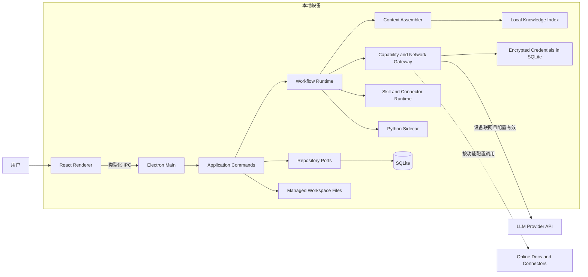

# RealmFlow 本地优先 AI 工作流产品架构

状态：设计评审稿

日期：2026-09-17

## 1. 文档目的

本文定义 RealmFlow 的目标产品能力、核心领域模型、运行时架构、本地目录结构、数据与网络边界，以及从当前实现演进到目标架构的优先级。

RealmFlow 是一个本地优先的 AI 工作流桌面客户端。用户通过流程模板组织软件开发全生命周期或其他可重复流程，通过空间沉淀知识，通过需求实例执行流程。业务数据、流程状态、知识索引、对话和产物均保存在本机；当设备具备网络连接时，模型、在线文档、连接器和更新等功能可以直接发起所需网络请求。

## 2. 产品目标

RealmFlow 应支持以下完整闭环：

1. 用户在设置中选择应用工作文件夹并配置模型。
2. 用户创建空间，应用在工作文件夹下创建对应空间目录。
3. 用户为空间维护本地文件、在线文档和代码仓库等知识来源。
4. 用户创建包含节点、依赖关系、技能和连接器配置的流程模板。
5. 用户在空间下新建需求，选择一个流程模板版本，并可在需求内继续调整节点编排。
6. 应用在空间目录下创建需求目录，并保存该需求的全部正式产物。
7. 工作流运行时根据 DAG 依赖关系执行当前节点。
8. AI 使用前置节点产物、空间知识库、需求上下文和用户输入生成产物与待办。
9. AI 遇到信息缺失或决策冲突时，在当前节点对话中向用户提问并暂停推进。
10. 当前节点必需待办完成、产物校验通过且不存在未解决问题后，应用自动推进下一个节点。
11. 普通对话和空间内对话统一出现在最近对话列表中，需求节点对话只在对应节点详情中展示。
12. 定时任务可在本地调度，并复用同一套模型、技能、连接器、权限和运行审计能力。
13. 应用重新打开后自动唤醒并继续可恢复的中断任务。
14. 需求完成后，可将正式产物自动同步到空间知识库。

## 3. 产品原则

### 3.1 本地优先

- SQLite、文件系统和应用私有凭据密钥文件是本地数据基础设施。
- Electron Main 是业务数据和本地能力的唯一所有者。
- Renderer 不直接访问 SQLite、文件系统、Shell 或 Python Sidecar。
- Python Sidecar 不直接访问 SQLite，不直接提交正式产物。
- 无网络时，除依赖外部模型或连接器的操作外，应用仍可浏览、编辑、搜索和管理本地内容。

### 3.2 联网可用性

- 当设备具备网络连接且相关服务配置有效时，模型、在线文档、远程仓库、连接器、检查更新和在线帮助可以直接发起请求。
- 不要求用户额外启用联网能力、授予目标域名或逐次确认网络调用。
- 需要账号认证的模型和连接器只要求用户完成对应凭据配置。
- 所有出站请求统一经过网络网关，以实现代理、超时、重试、统计、日志脱敏和故障诊断，但网络网关不承担逐域名授权职责。
- 模型调用保存上下文来源摘要和用量统计，方便用户了解调用规模与成本。

### 3.3 模板与实例分离

- 流程模板是可复用定义。
- 已发布模板版本不可原地修改。
- 新建需求时以模板版本快照作为需求流程实例的初始结构。
- 后续修改模板不能静默改变已运行需求。
- 需求创建后形成独立的流程实例。
- 用户可以在需求流程实例中删除未执行节点、插入节点、调整连接关系和执行顺序，不反向修改模板版本。

### 3.4 可恢复与可审计

- 流程状态、节点状态、待办、问题、模型调用和产物版本均可恢复。
- 应用退出或异常终止后，运行中的任务进入 `interrupted`；应用重新打开后自动唤醒并从最近安全检查点继续。
- 用户主动暂停的流程或节点保持暂停，不在应用启动时自动恢复。
- 每次自动推进必须记录触发条件和状态变更事件。
- 每个正式产物都可追溯到节点运行、上下文快照、模型和模板版本。

## 4. 功能信息架构

### 4.1 设置

#### 通用设置

- 语言：简体中文、English、日本语。
- 主题：亮色、暗色、跟随系统。
- 应用工作文件夹：选择、查看和重新选择当前默认目录。

#### 模型池

- 添加、更新、删除、启用和禁用模型配置。
- 支持多个 Provider 和同一 Provider 下的多个模型。
- 配置模型能力：文本、视觉、工具调用、结构化输出和上下文长度。
- 验证 API 地址、认证信息和模型可用性。
- API Key 加密后存储在 RealmFlow SQLite 数据库中，不写入环境变量、日志或工作目录。
- 查看请求次数、输入 Token、输出 Token、缓存 Token、推理 Token、延迟、成功率和成本等模型统计。
- 支持按时间、Provider、模型、空间、需求、节点和对话维度筛选统计。

#### 关于

- 当前版本。
- 检查更新。
- 本地帮助文档。
- 设备联网时打开在线帮助。

### 4.2 新对话

- 输入提示词。
- 通过提示词模板快速填充。
- 选择模型、技能、连接器、工作空间上下文和工作空间操作权限。
- 添加本地附件。
- 创建后形成普通对话会话。
- 普通对话可以不绑定上下文，也可以选择现有 RealmFlow 空间目录或任意任务本地文件夹。
- 选择 RealmFlow 空间时可以读取该空间知识库。
- 选择任务本地文件夹时，只建立当前对话的文件夹上下文和访问范围，不自动创建 RealmFlow 空间。

### 4.3 定时任务

- 查看进行中、暂停、失败和已完成任务。
- 查看基于本地使用场景生成的推荐任务。
- 创建、编辑、暂停、恢复、立即执行和删除定时任务。
- 使用本地 Cron 调度。
- 每次执行产生独立运行记录。
- 任务必须显式绑定模型、技能、连接器、空间和权限。

### 4.4 空间

- 新建、重命名和删除空间。
- 查看需求统计、流程分布、运行状态和近期活动。
- 管理空间知识库。
- 在当前空间内创建对话，默认选中当前空间。
- 空间内对话默认继承空间上下文，但文件、终端和仓库修改权限仍由权限策略控制。

### 4.5 自定义流程

- 创建、复制、编辑、发布和停用流程模板。
- 通过 DAG 编辑器增加节点和连接关系。
- 配置节点输入、提示词、模型选择策略、技能、连接器、产物规范、待办规则和完成门禁。
- 发布时校验无环、入口节点、可达性、终止节点和节点配置完整性。
- 已发布模板通过新版本继续演进。
- 需求中的流程实例允许在不修改原模板的前提下继续调整未执行部分。

### 4.6 需求

- 在空间下新建需求并选择流程模板版本。
- 删除需求。
- 查看横向 DAG、节点状态和整体进度。
- 查看当前节点说明、上下文来源、AI 对话、待办和产物。
- 手动点击节点进入详情，并可暂停当前流程或正在执行的节点。
- 在需求实例内插入节点、删除未执行节点、调整连接关系和执行顺序。
- 执行、恢复、取消、重试或跳过允许跳过的节点。
- 所有节点完成后，需求进入完成状态。
- 需求完成后，根据需求设置自动将正式产物同步到所属空间知识库。

### 4.7 最近

- 只展示普通对话和空间对话。
- 支持按普通对话、空间、绑定文件夹和时间筛选。
- 需求节点对话不进入最近列表，只能从需求下的具体节点详情查看。

## 5. 本地目录架构

### 5.1 目录结构

用户在设置中选择当前应用工作文件夹。新空间在当前工作文件夹下创建，需求在所属空间目录下创建。用户之后选择新的工作文件夹时，只改变新建空间的默认位置，已有空间继续使用原有目录，不移动、不复制且不受影响。

```text
<application-work-root>/
├── .realmflow/
│   ├── root.json
│   ├── tmp/
│   └── trash/
├── 产品研发空间--sp_a1b2c3/
│   ├── .realmflow/
│   │   └── space.json
│   ├── 登录体验优化--req_d4e5f6/
│   │   ├── .realmflow/
│   │   │   └── requirement.json
│   │   ├── artifacts/
│   │   │   ├── node_analysis/
│   │   │   ├── node_design/
│   │   │   └── node_testing/
│   │   ├── attachments/
│   │   └── workspace/
│   └── 支付流程改造--req_g7h8i9/
└── 个人效率空间--sp_j1k2l3/
```

### 5.2 命名规则

- 目录名采用 `{安全化名称}--{稳定短ID}`。
- 稳定 ID 用于避免重名、大小写冲突和非法字符问题。
- SQLite 中保存每个空间的规范化绝对路径及其创建时工作根目录，需求保存相对空间目录的路径。
- 展示名称修改默认不自动移动物理目录。
- 物理目录重命名作为独立命令执行，并检查运行任务、打开文件和 Git 工作区状态。

### 5.3 数据分布

| 数据 | 存储位置 | 所有者 |
| --- | --- | --- |
| 当前应用工作文件夹路径、历史根目录 | SQLite | Electron Main |
| 空间、需求、流程和运行元数据 | `userData/realmflow.db` | Electron Main |
| 对话、待办和审计事件 | `userData/realmflow.db` | Electron Main |
| 加密后的 API Key | `userData/realmflow.db` | Electron Main |
| 数据库凭据加密密钥 | `userData` 下权限受限的应用私有密钥文件 | Electron Main |
| 正式产物 | 需求目录 | Electron Main 文件服务 |
| 用户附件 | 需求或空间目录 | Electron Main 文件服务 |
| 知识索引 | 本地 SQLite 或本地索引文件 | Electron Main / Sidecar Adapter |
| 临时生成内容 | `.realmflow/tmp` | Electron Main |
| 已删除目录 | `.realmflow/trash` | Electron Main |
| UI 偏好 | Renderer `localStorage` | Renderer |

### 5.4 创建与删除一致性

创建空间或需求：

1. 校验父目录和名称。
2. 生成稳定 ID、相对路径和临时目录。
3. 写入本地清单。
4. 在 SQLite 事务中创建业务记录。
5. 原子重命名临时目录为正式目录。
6. 提交事务。
7. 任一步失败时回滚数据库并清理临时目录。

删除空间或需求：

1. 检查是否存在运行中任务。
2. 将目录原子移动到 `.realmflow/trash`。
3. 在 SQLite 中写入删除状态和原路径。
4. 支持恢复和手动永久清理。
5. 永久删除空间前再次确认其包含的需求、产物和知识资源数量。

### 5.5 切换当前工作文件夹

应用不提供工作文件夹迁移能力。用户重新选择工作文件夹时：

1. 校验新目录存在且可写。
2. 将新目录保存为当前默认工作根目录。
3. 后续新建空间只在新目录下创建。
4. 已有空间保留原绝对路径，不移动、不复制、不删除。
5. 历史工作根目录继续保留在本地登记表中，用于管理已有空间。
6. 已有空间目录被用户手动移动后，可通过“重新定位空间”修复该空间路径。

## 6. 目标运行时架构



### 6.1 Renderer

职责：

- 页面渲染和用户交互。
- 展示工作流、节点、待办、对话、产物和运行状态。
- 发送结构化命令。
- 订阅领域事件和流式输出。

禁止：

- 直接访问 SQLite、文件系统和 Sidecar。
- 保存完整业务聚合快照。
- 自行决定工作流推进。
- 持有明文 API Key 或凭据解密密钥。

### 6.2 Electron Main

职责：

- 应用组合根和业务数据唯一所有者。
- 执行空间、需求、流程、对话、待办和调度命令。
- 运行工作流状态机。
- 管理文件、数据库事务和原子提交。
- 管理文件与终端权限、数据库凭据加密和统一网络调用。
- 管理 Sidecar 生命周期和运行恢复。

### 6.3 Python Sidecar

职责：

- Provider Adapter。
- Prompt 构建和模型流式调用。
- 技能执行。
- 文档解析、Embedding 和本地检索。
- 可选 Agent 策略和工具调用循环。

禁止：

- 直接访问 SQLite。
- 自行推进需求或节点状态。
- 绕过 Main 的网络网关访问网络，或绕过文件权限访问本地文件。
- 直接覆盖正式产物。

Sidecar 只返回事件和候选产物，最终提交由 Electron Main 完成。

### 6.4 本地 Sidecar 通信

- 仅监听回环地址或使用 Unix Domain Socket。
- 每次应用启动生成随机认证令牌。
- Electron Main 启动 Sidecar 时通过环境变量或受保护管道传入令牌。
- 每个请求必须验证令牌。
- Sidecar 不向 Renderer 暴露端口。

## 7. 核心领域模型

### 7.1 聚合与实体

| 聚合 | 主要实体 | 关键职责 |
| --- | --- | --- |
| AppSettings | WorkRoot、Locale、Theme | 应用级本地配置 |
| ModelPool | Provider、ModelProfile、SecretRef | 模型配置和能力选择 |
| CapabilityCatalog | Skill、Connector | 可复用执行能力 |
| WorkflowTemplate | TemplateVersion、Node、Edge | 可发布流程定义 |
| Space | KnowledgeSource | 空间及知识范围 |
| Requirement | WorkflowInstance | 需求与模板快照 |
| WorkflowExecution | NodeRun、Todo、Question | 流程执行与推进 |
| Conversation | Message、Attachment | 普通、空间和节点对话 |
| Artifact | ArtifactVersion | 产物元数据与版本 |
| Schedule | ScheduleRun | 本地定时执行 |
| PermissionGrant | CapabilityScope | 文件、终端和仓库修改授权 |
| AuditTrail | DomainEvent、OutboundCall | 操作和出站审计 |

### 7.2 流程节点定义

每个模板节点至少包含：

- `id`：模板版本内稳定标识。
- `type`：`ai_generate | human_input | tool | approval`。
- `name` 和说明。
- 前置节点集合。
- 输入上下文选择规则。
- 模型选择策略。
- 技能和连接器引用。
- 权限声明。
- Prompt 模板。
- 产物规范。
- 待办生成规则。
- 完成门禁。
- 失败和重试策略。
- 是否允许跳过。

### 7.3 DAG 规则

- 发布前必须验证无环。
- 所有节点必须从入口节点可达。
- 至少存在一个终止节点。
- 边引用的节点必须存在。
- 第一阶段允许 DAG 定义分支，但同一需求默认串行执行一个节点。
- 多个节点同时就绪时，按照模板顺序进入就绪队列。
- 并行节点执行作为后续能力，不影响数据模型。
- 需求创建后复制模板节点和边，形成独立可编辑的流程实例。
- 用户可以在需求内插入节点、删除未执行节点和调整未执行部分的边。
- 已完成节点不可直接删除或改写；如需调整，必须从目标节点执行显式回退，并使其下游运行与产物失效。
- 正在执行的节点必须先暂停或取消，才能调整与该节点相关的拓扑。
- 每次实例编排修改都必须重新执行无环、可达性和入口终点校验，并记录修订版本。

### 7.4 状态机

流程实例状态：

```text
created | running | waiting_user | paused |
completed | failed | cancelled | interrupted
```

节点运行状态：

```text
pending | ready | running | waiting_user | blocked |
completed | failed | skipped | cancelled | interrupted
```

待办状态：

```text
pending | in_progress | completed | blocked | cancelled
```

问题状态：

```text
open | answered | dismissed
```

现有 AI Run 状态继续使用：

```text
created | running | cancelling |
completed | failed | cancelled | interrupted
```

## 8. 工作流推进规则

节点进入 `completed` 必须同时满足：

1. AI 或人工执行步骤已结束。
2. 所有必需产物已生成并通过结构校验。
3. 所有必需待办均为 `completed`。
4. 不存在 `open` 状态的必答问题。
5. 审批节点已获得明确结果。
6. 节点完成门禁返回通过。

完成后由 `AdvanceWorkflowUseCase` 在一个事务中：

1. 标记当前节点完成。
2. 计算新就绪节点。
3. 更新需求当前节点和整体状态。
4. 写入领域事件。
5. 自动启动配置为自动执行的下一个节点。

Renderer 只能发出命令，不能直接修改节点状态或推进流程。

### 8.1 暂停与启动恢复

- 用户在需求页点击节点可进入节点详情，并暂停当前节点或整个流程。
- 暂停先阻止新的工具调用和下游节点启动，再取消可取消的模型流与工具进程。
- 已接收的流式内容保存为草稿或检查点，不直接提交为正式产物。
- 用户恢复节点时从最近安全检查点继续；无法续接的外部模型请求以同一上下文快照重新发起，并通过幂等键避免重复提交。
- 应用正常退出或异常终止时，将仍在执行的节点和 AI Run 标记为 `interrupted`。
- 应用重新打开后，Electron Main 在窗口可交互前扫描 `interrupted` 记录，重建执行上下文并自动加入恢复队列。
- `paused`、`waiting_user`、`blocked`、`cancelled` 和已完成任务不自动恢复。
- 自动恢复失败时保持 `interrupted`，记录失败原因并在节点详情中提供手动重试。

## 9. 上下文装配

`ContextAssembler` 为每次模型运行生成不可变上下文快照。

上下文来源按顺序包括：

1. 当前需求标题、描述、范围和验收标准。
2. 当前节点定义、Prompt 和产物规范。
3. 所有直接前置节点的正式产物。
4. 模板声明需要继承的祖先节点产物。
5. 当前节点对话中的用户回答。
6. 未完成待办和已知阻塞。
7. 从空间知识库检索出的相关片段。
8. 用户本次显式添加的附件。

上下文快照记录：

- 来源实体和版本。
- 原始字符数和 token 估算。
- 检索评分。
- 裁剪、摘要和脱敏结果。
- 实际发送给模型的内容 checksum。
- 模型、Provider 和参数。

用户可以在运行前查看上下文来源，敏感文件默认不自动发送。

## 10. 知识库

空间资源不能只保存名称和 URL，必须形成完整摄取生命周期：

```text
registered -> syncing -> indexed -> stale | failed | removed
```

### 10.1 本地文件

- 复制到受管目录或保存外部文件授权引用。
- 默认推荐复制到空间目录，保证本地留存和可恢复。
- 检测文件变化并增量重新索引。

### 10.2 在线文档

- 添加后在设备联网时直接读取文档并保存本地快照。
- 设备联网且连接器配置有效时直接抓取。
- 抓取结果保存为本地快照。
- 模型运行默认读取本地快照，不隐式重新联网。

### 10.3 代码仓库

- 本地仓库直接索引。
- 远程仓库在凭据配置有效且设备联网时克隆到空间目录。
- 索引尊重 `.gitignore` 和 RealmFlow 排除规则。
- 默认排除 `.env`、凭据、构建目录和大型二进制文件。

### 10.4 检索

- 文档解析、分块和 Embedding 在本地执行。
- 索引记录来源文件、范围、checksum 和更新时间。
- 支持关键词检索与向量检索组合。
- 删除知识源时同步删除索引，不删除用户未托管的原文件。

### 10.5 需求产物回灌

- 空间或需求可以配置 `sync_completed_artifacts_to_knowledge`。
- 需求进入 `completed` 后，由 Electron Main 创建本地知识同步任务。
- 只同步正式产物，不同步临时文件、流式草稿、日志和中间检查点。
- 每个知识文档保存来源需求、来源节点、Artifact ID、版本和 checksum。
- 相同 Artifact 版本重复触发时保持幂等，不产生重复知识片段。
- 产物后续发布新版本时，更新对应知识文档并重建受影响的索引片段。
- 回灌失败不回退需求完成状态，而是生成可重试的知识同步失败记录。
- 回灌是本地操作，不需要网络或模型调用。

## 11. 模型、技能与连接器

### 11.1 模型池

模型配置包含：

- Provider 类型。
- API Base URL。
- 模型 ID。
- 密钥引用。
- 能力标签。
- 上下文限制。
- 超时、重试和并发限制。
- 启用状态。

节点可以固定模型，也可以声明能力要求，由本地路由器从启用模型中选择。

API Key 使用应用生成的本地加密密钥加密后写入 `model_credentials`。加密密钥保存在 Electron `userData` 下权限受限的应用私有文件中，不写入环境变量，不使用系统 Keychain。Main 仅在发起 Provider 请求时短暂解密，Renderer、日志和 Sidecar 启动参数均不能获得明文密钥。

### 11.2 技能

技能是本地可版本化执行单元，包含：

- 元数据和输入输出 Schema。
- Prompt 或执行入口。
- 文件和终端权限声明。
- 所需网络服务配置。
- 超时和资源限制。
- 安装来源和 checksum。

未经确认的技能不能获得已选空间或任务本地文件夹之外的文件访问权限。

### 11.3 连接器

连接器负责外部系统访问：

- 每个连接器独立保存服务地址和所需账号凭据。
- 凭据加密存储在 RealmFlow SQLite 数据库中。
- 设备联网且连接器配置有效时可以直接调用，不要求额外域名授权。
- 调用前检查节点是否配置了该连接器。
- 返回结果先落本地快照，再进入上下文。
- 所有调用写入出站审计。

## 12. 对话模型

对话分为：

- `general`：不绑定空间的普通对话。
- `space`：绑定空间并可检索空间知识。
- `requirement_node`：绑定需求和节点运行。
- `schedule`：用于创建或修订定时任务。

消息角色：

```text
system | user | assistant | tool
```

消息应支持：

- 流式状态。
- 附件引用。
- 模型和技能调用记录。
- 工具结果。
- 错误和重试。
- 与节点问题、待办和产物的关联。

节点对话中的用户回答可关闭对应问题并触发节点继续执行。

需求节点对话属于需求执行记录，不进入“最近”菜单。普通对话和空间对话进入“最近”菜单。

## 13. 权限模型

权限采用能力和范围组合，不使用一个笼统的“全部权限”布尔值。权限模型只约束本地文件、终端、仓库修改等高影响操作，不对网络目标域名进行逐项授权。

能力示例：

- `filesystem.read`
- `filesystem.write`
- `terminal.execute`
- `repository.modify`

范围示例：

- 当前需求目录。
- 当前空间目录。
- 选定文件。
- 指定命令。

授权模式：

- `ask`：每次询问。
- `session`：本次会话有效。
- `requirement`：当前需求有效。
- `space`：当前空间有效。
- `persistent`：持久授权，可在设置中撤销。

默认不提供无边界的“全部权限”。空间内新对话可以默认选中当前空间，但必须显示其实际本地操作权限范围。网络请求在设备联网且服务配置有效时直接执行。

## 14. 定时任务架构

定时任务由 Electron Main 的本地调度器负责。

每个任务包含：

- Cron 表达式和时区。
- 启用状态。
- 对话式任务描述。
- 结构化执行定义。
- 绑定空间、模型、技能和连接器。
- 权限快照。
- 错误重试策略。
- 上次和下次执行时间。

应用未运行时不承诺后台执行。应用再次启动后，根据任务策略决定跳过错过的执行或补跑一次，不能无上限补跑。

## 15. 出站网络与模型统计

所有外部请求通过统一 `NetworkGateway`，但不要求用户启用联网能力、授予目标域名或逐次确认：

1. 根据模型、连接器、在线文档或更新配置确定目标地址。
2. 检查设备网络状态和所需凭据。
3. 对日志中的凭据和敏感字段进行脱敏。
4. 应用统一代理、超时、重试、并发和取消策略。
5. 执行请求并保存请求类型、耗时、状态和错误摘要。

每次模型调用额外记录：

- Provider、模型和请求来源。
- 普通对话、空间、需求、节点、AI Run 等业务归属。
- 输入、输出、缓存和推理 Token。
- 首 Token 延迟、总耗时和吞吐量。
- 成功、失败、取消和重试次数。
- 按模型价格配置估算的输入、输出和总成本。
- 上下文快照 ID，不重复保存完整敏感内容。

统计数据全部保存在本地，提供总览、趋势和分组查询。价格由内置默认值与用户配置共同维护，统计页面明确标记成本为估算值。

## 16. 建议数据库实体

在现有表基础上新增：

```text
app_settings
model_providers
model_profiles
model_credentials
model_call_metrics
model_usage_rollups
skills
skill_versions
connectors
connector_credentials
workflow_templates
workflow_template_versions
workflow_nodes
workflow_edges
requirement_workflows
requirement_workflow_revisions
requirement_nodes
requirement_edges
workflow_executions
node_runs
node_todos
node_questions
context_snapshots
knowledge_sources
knowledge_documents
knowledge_chunks
knowledge_sync_jobs
conversation_attachments
conversation_folder_bindings
schedules
schedule_runs
permission_grants
audit_events
outbound_calls
deleted_items
```

现有表继续承担：

```text
workspaces
requirements
chat_sessions
chat_messages
space_resources
artifacts
ai_runs
ai_run_events
schema_migrations
```

`space_resources` 后续可迁移为 `knowledge_sources`，不再只表示展示用书签。

## 17. IPC 与应用服务

Renderer 不再提交完整业务数据集，应改为意图明确的命令：

```text
settings:select-work-root
settings:list-work-roots
space:create
space:rename
space:delete
space:relocate
requirement:create
requirement:delete
requirement-workflow:insert-node
requirement-workflow:remove-node
requirement-workflow:update-edge
requirement-workflow:reorder
workflow-template:save-draft
workflow-template:publish
workflow:start
workflow:pause
workflow:resume
node:pause
node:resume
node:retry
todo:update-status
question:answer
conversation:send
knowledge:add-source
knowledge:sync
knowledge:sync-requirement-artifacts
schedule:create
schedule:pause
model-stats:query
```

查询接口与命令接口分离。所有 IPC payload 在 Main 边界执行运行时校验。

## 18. 错误处理与恢复

- 创建目录失败：不写入业务记录。
- SQLite 写入失败：清理临时目录并返回结构化错误。
- 原子 rename 失败：回滚事务并恢复旧文件。
- 模型超时：保留上下文快照和已接收内容，节点进入失败或等待重试。
- Sidecar 崩溃：活动 Run 进入 `interrupted`。
- 文件被外部修改：使用 checksum 和版本比较，禁止静默覆盖。
- 当前默认工作根目录丢失：禁止创建新空间，并提示重新选择工作文件夹；其他路径正常的已有空间不受影响。
- 已有空间目录丢失：仅该空间进入不可用状态，并支持单空间重新定位。
- 知识索引损坏：从本地源文件重建，不影响正式产物。
- 模板配置非法：禁止发布，不影响现有模板版本。
- 自动推进失败：当前节点保持完成，下一个节点进入可重试的启动失败状态。

## 19. 测试策略

### 19.1 领域测试

- DAG 无环、可达性和发布校验。
- 模板版本不可变。
- 节点和流程状态机。
- 待办、问题和完成门禁。
- 权限范围合并和拒绝规则。

### 19.2 应用层测试

- 空间和需求目录创建事务。
- 当前工作根目录切换和历史空间路径保持。
- 单空间重新定位。
- 上下文装配和 token 裁剪。
- 节点完成后的自动推进。
- 应用启动自动恢复、中断续跑和幂等重试。
- 需求实例节点插入、删除、调整和拓扑校验。
- 模型调用统计聚合和成本估算。
- 定时任务错过执行策略。

### 19.3 基础设施测试

- SQLite Migration 和 Repository。
- 数据库凭据加密和密钥文件权限。
- Provider Adapter。
- 文件原子提交和越界路径拒绝。
- Sidecar 认证、SSE 重连和事件去重。
- 知识索引增量更新。
- Network Gateway 的代理、超时、重试和统计。

### 19.4 架构守卫

- Renderer 禁止导入 Node、Electron、SQLite 和 Sidecar Client。
- Sidecar 禁止访问 SQLite 和正式产物路径。
- IPC 禁止承载业务编排。
- Application 层禁止依赖 React。
- Provider、Skill 和 Connector 必须通过 Port 接入。
- 所有网络请求必须通过 Network Gateway。

## 20. 当前实现差距

当前已具备：

- Electron Main、Renderer 和 Python Sidecar 进程边界。
- SQLite 主存储、Migration、WAL、外键和 revision CAS。
- 空间、需求、会话、资源和产物基础持久化。
- AI Run 状态机、SSE、取消、重连、事件去重和中断恢复。
- 正式产物的临时文件、数据库事务和原子替换。
- 文件、网页、终端工作区和安全 IPC。

当前尚未形成目标产品闭环：

- 六个需求阶段仍为固定枚举，不是流程模板实例。
- 没有工作流模板、节点、边、待办、问题和推进引擎。
- 没有真实模型 Provider 和安全密钥管理。
- 没有模型调用 Token、延迟、成功率和成本统计。
- 普通对话只保存用户消息，没有接入 AI Run。
- 节点上下文没有包含前置节点产物和空间知识库。
- 空间资源仍是元数据和 URL 列表，没有摄取与检索。
- 定时任务是页面内静态数据，没有持久化和调度执行。
- 模型、技能、连接器和权限选择器没有进入业务命令。
- 设置、多语言、主题、更新、备份和帮助仍是占位能力。
- 需求仍支持独立目录绑定，没有完全收敛为工作根目录层级。
- 需求流程实例不支持插入、删除和调整节点。
- 中断任务不会在应用重新打开后自动续跑。
- 需求完成后不会自动将正式产物同步到空间知识库。

## 21. 实施优先级

### P0-A：本地工作目录

- 应用工作文件夹设置。
- 空间和需求目录生命周期。
- 多工作根登记、单空间重新定位、安全路径、清单和垃圾箱。
- 将 Renderer 聚合快照保存改为 Main 命令。

### P0-B：流程领域

- 模板版本、节点、边和发布校验。
- 需求基于模板创建可独立调整的流程实例。
- Workflow Runtime、NodeRun、Todo、Question 和自动推进。
- 节点暂停、自动恢复和实例 DAG 编辑。

### P0-C：真实 AI 闭环

- 模型池、数据库凭据加密和 Provider Gateway。
- 模型调用统计与成本估算。
- ContextAssembler。
- 普通对话和节点对话。
- 产物校验、审计和重试恢复。

### P1：知识、技能与调度

- 本地知识摄取和检索。
- 需求完成后正式产物自动回灌空间知识库。
- 技能运行时。
- 连接器和统一网络调用。
- 定时任务持久化和本地调度。

### P2：产品完善

- 多语言和主题。
- 更新、帮助、备份和恢复。
- 其他产品统计分析。
- 模板迁移和并行节点执行。

## 22. 第一阶段验收标准

第一阶段完成时应满足：

1. 创建第一个空间前必须选择可写的当前应用工作文件夹。
2. 新建空间会在根目录下创建唯一空间目录。
3. 新建需求必须选择流程模板，并在空间目录下创建唯一需求目录。
4. 用户可以创建至少包含三个节点的流程模板。
5. 需求详情展示需求实例 DAG 和节点状态，并支持插入、删除和调整未执行节点。
6. 节点可以读取前置节点产物和空间知识索引。
7. 节点可以生成产物和待办，并在缺少信息时向用户提问。
8. 必需待办完成后能够自动推进下一个节点。
9. 应用重启后可以自动唤醒并继续可恢复的中断任务，用户主动暂停的任务除外。
10. API Key 加密保存在 SQLite，不出现在日志、工作目录和 Renderer。
11. 所有正式产物都位于需求目录内。
12. 设备联网且服务配置有效时，不需要额外网络授权即可调用模型、在线文档和连接器。
13. 模型调用可以按模型、空间、需求和节点统计 Token、耗时、成功率与估算成本。
14. 普通对话可选择 RealmFlow 空间或任意任务本地文件夹。
15. 最近列表不展示需求节点对话。
16. 需求完成后可自动将正式产物同步到空间知识库。

## 23. 当前推荐决策

本设计采用以下默认决策：

- SQLite 保留在 Electron `userData`，工作文件夹存储用户可见文件和正式产物。
- 设置只维护当前默认工作文件夹，不迁移已有空间；空间可以分布在多个历史工作根目录。
- 显示名称和物理目录名解耦，普通重命名不自动移动目录。
- 删除先进入本地垃圾箱，不立即永久删除。
- 需求基于不可变模板版本创建独立流程实例，实例的未执行节点可以继续调整。
- 第一阶段执行器支持完整 DAG 校验，但节点默认串行执行。
- 设备联网且服务配置有效时可直接联网，不提供逐域名授权流程。
- API Key 加密存储在 RealmFlow SQLite 数据库中，凭据加密密钥保存在应用私有目录。
- 应用重新打开后自动唤醒中断任务，用户主动暂停的任务保持暂停。
- 最近列表只展示普通对话和空间对话。
- 需求完成后可自动回灌正式产物到空间知识库。
- Electron Main 负责流程编排，Sidecar 负责 AI、技能和检索执行。

这些决策构成后续实施计划的架构基线。评审修改应先更新本文，再进入任务拆分和编码。
